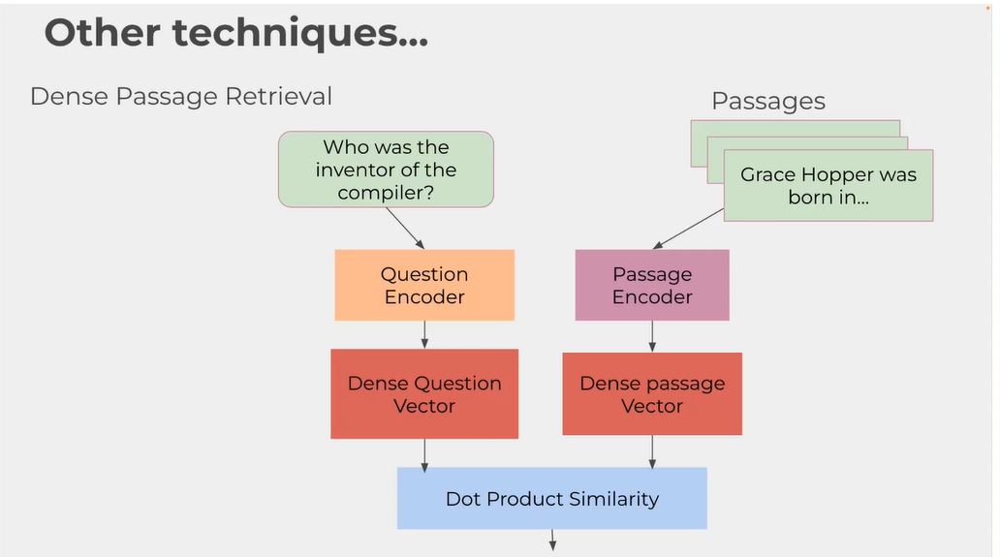
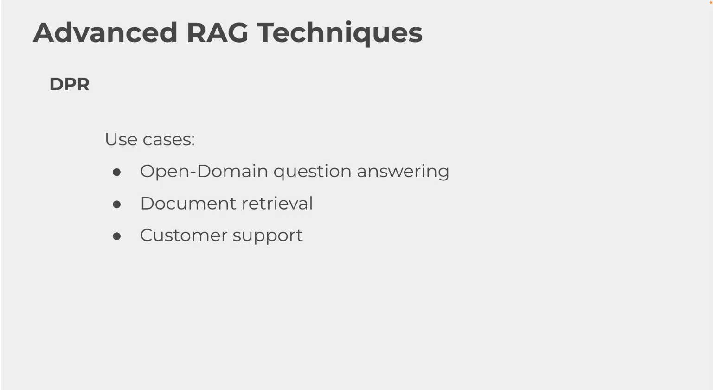

# DPR trong RAG

DPR (Dense Passage Retrieval) là kỹ thuật truy xuất đoạn văn bằng embedding dày, trong đó query và passage được mã hóa riêng bằng hai encoder chuyên biệt. Mục tiêu của DPR là tìm ra những đoạn văn có ý nghĩa gần nhất với câu hỏi người dùng, thay vì dựa vào so khớp từ khóa thuần túy.

## Ý tưởng chính

Trong RAG, retriever là thành phần quyết định dữ liệu nào sẽ được đưa vào bước sinh câu trả lời. DPR giải quyết bài toán truy xuất bằng cách:

1. Mã hóa câu hỏi bằng question encoder.
2. Mã hóa từng passage hoặc chunk bằng context encoder.
3. Biểu diễn cả query và passage trong cùng một không gian vector.
4. Tính độ tương đồng giữa query embedding và các context embeddings để tìm những đoạn liên quan nhất.

## Cách hoạt động trong code

Trong file `dense_passage_retrieval_no_vector_db.py`, luồng xử lý đi theo các bước sau:

1. Đọc tài liệu PDF và trích xuất toàn bộ văn bản.
2. Chia văn bản thành các chunk nhỏ bằng `RecursiveCharacterTextSplitter`.
3. Khởi tạo `DPRQuestionEncoder` và `DPRContextEncoder` từ model `facebook/dpr-question_encoder-single-nq-base` và `facebook/dpr-ctx_encoder-single-nq-base`.
4. Nhận câu hỏi từ người dùng.
5. Tokenize và encode câu hỏi để lấy query embedding.
6. Tokenize từng chunk và encode thành context embedding.
7. Dùng `cosine_similarity` để so sánh query embedding với toàn bộ context embeddings.
8. Sắp xếp kết quả và lấy ra top 5 chunk giống nhất.

Điểm đáng chú ý là phiên bản này chưa dùng vector database. Tất cả embedding được tạo và so sánh trực tiếp trong bộ nhớ, nên code dễ hiểu và phù hợp để demo nguyên lý của DPR.

## Vì sao DPR hiệu quả

Khác với truy xuất dựa trên từ khóa, DPR học cách hiểu ngữ nghĩa của câu hỏi và đoạn văn. Điều này giúp hệ thống tìm được những đoạn liên quan ngay cả khi câu hỏi và tài liệu không dùng cùng từ ngữ.

Ví dụ, một câu hỏi ngắn hoặc diễn đạt lại theo cách khác vẫn có thể khớp với chunk chứa nội dung đúng vì mô hình đã học các biểu diễn ngữ nghĩa gần nhau trong không gian vector.

## DPR khác gì vector database

DPR và vector database đều liên quan đến embedding, nhưng chúng không phải là cùng một thứ:

- DPR là kỹ thuật truy xuất, tức là cách tạo ra embedding và đo độ tương đồng giữa query với passage.
- Vector database là hạ tầng lưu trữ và tìm kiếm embedding, giúp index, truy vấn nhanh và mở rộng trên dữ liệu lớn.
- DPR trả lời câu hỏi “làm sao để biểu diễn query và passage cho tốt hơn?”.
- Vector database trả lời câu hỏi “làm sao để lưu và tìm embedding hiệu quả hơn?”.
- DPR có thể chạy trực tiếp trong bộ nhớ như file demo này, còn vector database thường dùng khi cần scale và tối ưu tốc độ.
- DPR quyết định chất lượng semantic matching, còn vector database quyết định hiệu năng truy xuất và cách quản lý dữ liệu embedding.

Nói ngắn gọn, DPR là phần tạo ra tín hiệu truy xuất, còn vector database là nơi tổ chức và phục vụ tín hiệu đó ở quy mô lớn.

## Lợi ích

- Truy xuất tốt hơn so với so khớp từ khóa trong nhiều trường hợp.
- Hữu ích khi câu hỏi và tài liệu diễn đạt khác nhau nhưng cùng một ý.
- Kiến trúc rõ ràng, tách riêng query encoder và context encoder.
- Phiên bản không vector DB dễ dùng để giải thích cơ chế cốt lõi của DPR.

## Hạn chế

- Tốn tài nguyên hơn so với tìm kiếm từ khóa đơn giản vì phải encode toàn bộ chunk.
- Nếu không dùng vector database, việc truy xuất trên tập dữ liệu lớn sẽ chậm.
- Chất lượng phụ thuộc mạnh vào model DPR được chọn và cách chia chunk.
- Cần xử lý thêm nếu muốn mở rộng sang pipeline production với index và lưu trữ embedding.

## Ghi chú về cách đặt tên trong code

File `dense_passage_retrieval_no_vector_db.py` thể hiện đúng bản chất của demo: dùng DPR để truy xuất passage nhưng chưa lưu embedding vào vector database. Vì vậy, toàn bộ retrieval đang diễn ra trực tiếp bằng cách encode rồi tính cosine similarity trong runtime.

## Tóm tắt

DPR trong RAG là kỹ thuật dùng hai encoder riêng cho query và passage để đưa chúng vào cùng một không gian vector, rồi chọn các chunk có độ tương đồng cao nhất. Cách làm này giúp hệ thống truy xuất theo ngữ nghĩa tốt hơn, đặc biệt khi câu hỏi và tài liệu không trùng khớp từ ngữ.

