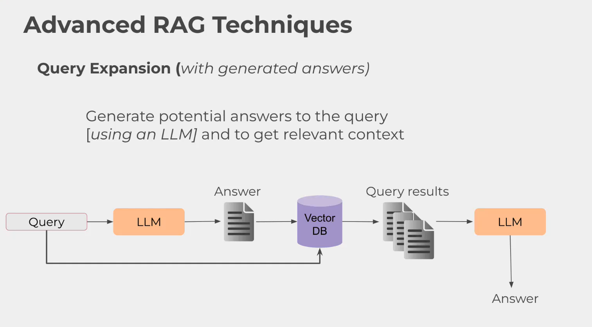
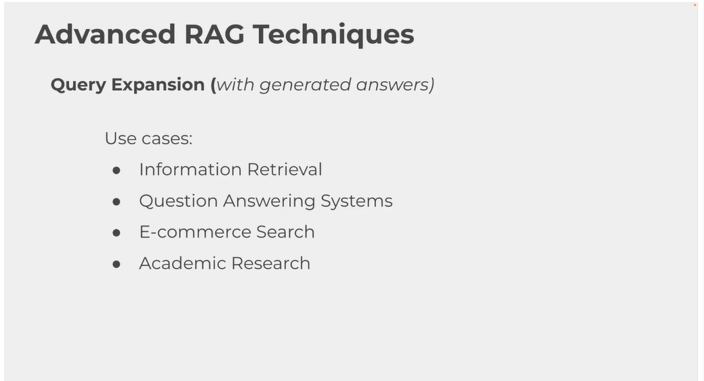

# Answer Expansion trong RAG

Answer expansion là kỹ thuật mở rộng câu hỏi người dùng bằng cách sinh ra một câu trả lời giả định hoặc một diễn giải đầy đủ hơn trước khi tìm kiếm trong vector database. Mục tiêu là tạo thêm ngữ cảnh ngữ nghĩa để retriever dễ khớp với các đoạn văn liên quan, đặc biệt khi câu hỏi ban đầu quá ngắn, mơ hồ hoặc thiếu từ khóa đặc trưng của tài liệu.

## Ý tưởng chính

Trong RAG, retriever thường lấy embedding của câu hỏi để tìm những chunk gần nhất trong không gian vector. Vấn đề là một câu hỏi ngắn có thể không chứa đủ tín hiệu để truy xuất đúng tài liệu. Answer expansion giải quyết bằng cách:

1. Giữ nguyên truy vấn gốc của người dùng.
2. Dùng LLM tạo ra một câu trả lời giả định hoặc một diễn giải đầy đủ hơn dựa trên ý định cốt lõi.
3. Thêm ngữ cảnh liên quan, tên riêng, chủ đề đặc trưng, hoặc cách diễn đạt gần với tài liệu nguồn.
4. Ghép truy vấn gốc và phần mở rộng lại trước khi embedding và retrieval.

## Cách hoạt động trong code

Trong file `expansion_answers.py`, luồng xử lý đi theo các bước sau:

1. Đọc tài liệu PDF và chia nhỏ thành các chunk.
2. Tạo embedding cho từng chunk và lưu vào ChromaDB.
3. Nhận câu hỏi từ người dùng.
4. Gọi hàm `generate_augment_query()` để LLM sinh ra nội dung mở rộng theo hướng answer expansion.
5. Ghép truy vấn gốc với phần mở rộng để tạo thành `joint_query`.
6. Dùng `joint_query` để truy xuất các chunk liên quan hơn.
7. Đưa các chunk đã truy xuất vào hàm sinh câu trả lời cuối cùng.

Điểm quan trọng là mô hình không trả lời cuối cùng ngay ở bước mở rộng. Nó chỉ tạo ra một phiên bản diễn giải giàu ngữ cảnh hơn để tăng “diện tích tìm kiếm” trong không gian ngữ nghĩa.

## Vì sao query expansion hiệu quả

Một câu hỏi như “What did he say about failure?” có thể quá chung chung. Nếu mở rộng thành một câu trả lời giả định hoặc diễn giải như:

- “Randy Pausch nói rằng thất bại là một phần của việc học và những bức tường gạch cho thấy ta thật sự muốn điều gì.”
- “The Last Lecture nhấn mạnh việc học từ sai lầm, vượt qua trở ngại và không xem thất bại là điểm kết thúc.”
- “Ông thường gắn thất bại với động lực, sự kiên trì và cách con người phản ứng trước khó khăn.”

thì hệ thống có thêm nhiều dấu hiệu ngữ nghĩa để tìm đúng đoạn văn hơn. Nói cách khác, thay vì chỉ tìm theo một vector duy nhất, ta tìm theo một biểu diễn giàu thông tin hơn.

## Lợi ích

- Tăng recall, tức khả năng tìm được chunk liên quan.
- Hữu ích với truy vấn ngắn, thiếu ngữ cảnh, hoặc dùng từ khác với tài liệu.
- Có thể tận dụng kiến thức của LLM để suy ra một diễn giải gần với câu trả lời mong đợi.

## Hạn chế

- Có thể làm phần mở rộng bị “lệch ý” nếu LLM suy diễn sai hướng.
- Nếu diễn giải quá rộng, retriever có thể kéo về nhiều chunk nhiễu hơn.
- Tốn thêm thời gian và chi phí vì phải gọi LLM trước khi truy xuất.

## Ghi chú về cách đặt tên trong code

Biến `hypothetical_answer` trong code thực tế đang chứa phần mở rộng theo hướng answer expansion, không phải câu trả lời cuối cùng. Tên này có thể gây nhầm lẫn, nhưng về mặt khái niệm nó đóng vai trò như một câu trả lời giả định để hỗ trợ retrieval.

## Tóm tắt

Answer expansion trong RAG là bước biến một câu hỏi gốc thành một diễn giải hoặc câu trả lời giả định giàu ngữ nghĩa hơn, rồi dùng phần mở rộng đó để tìm chunk liên quan chính xác hơn. Kỹ thuật này đặc biệt hữu ích khi dữ liệu cần tìm nằm rải rác hoặc được diễn đạt khác với cách người dùng đặt câu hỏi.

