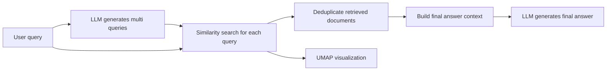
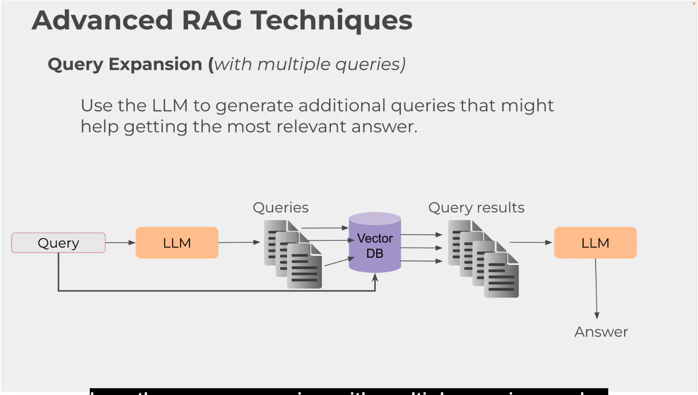
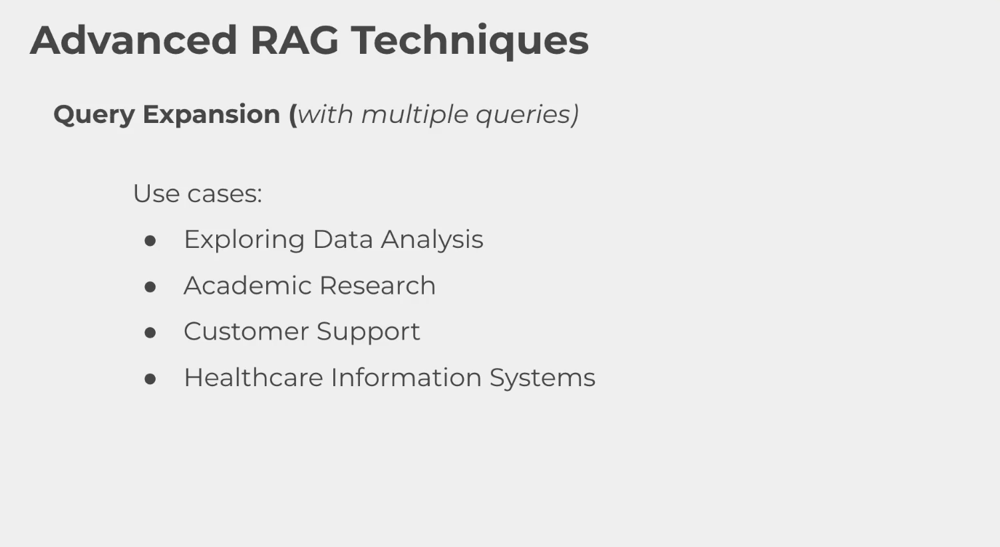
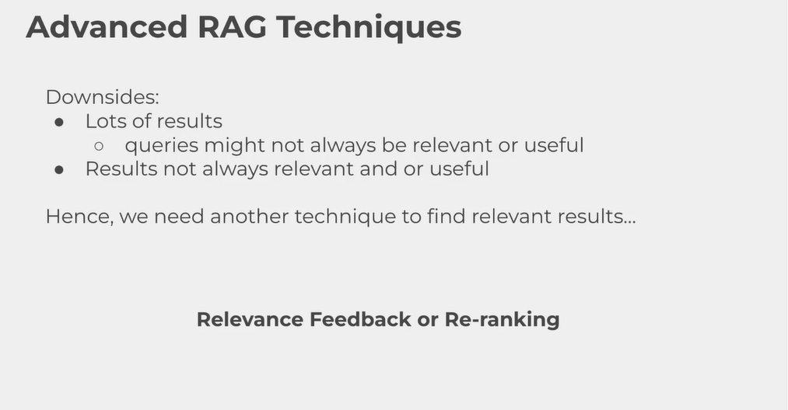

# RAG Query Expansion

## Ý tưởng chính

Query expansion là kỹ thuật mở rộng truy vấn gốc thành nhiều biến thể khác nhau trước khi đem đi tìm kiếm trong vector database. Trong RAG, cách này giúp hệ thống bắt được nhiều cách diễn đạt cùng một ý, đặc biệt khi người dùng hỏi ngắn, mơ hồ, hoặc dùng từ không khớp hoàn toàn với nội dung tài liệu.

Trong `expansion_queries.py`, quy trình được triển khai theo hướng sau:

1. Chia văn bản của sách _The Last Lecture_ thành các đoạn nhỏ.
2. Tạo embedding cho toàn bộ đoạn văn và lưu vào vector store.
3. Nhận câu hỏi gốc từ người dùng.
4. Dùng LLM sinh ra 3 đến 5 truy vấn mở rộng có cùng ngữ nghĩa.
5. Tìm kiếm với cả câu hỏi gốc lẫn các truy vấn mở rộng.
6. Gộp các chunk liên quan để tạo câu trả lời cuối cùng.

## Vì sao query expansion hữu ích

Một câu hỏi như `what did he say about failure?` có thể quá ngắn để match tốt với văn bản gốc. Query expansion sẽ biến nó thành nhiều biến thể như:

- `what did Randy Pausch say about failure and making mistakes?`
- `brick walls are there to show how badly we want something`
- `learning from failure, setbacks, and overcoming obstacles in The Last Lecture`

Nhờ đó, hệ thống không chỉ dựa vào một biểu thức duy nhất mà có thể tìm theo nhiều góc ngữ nghĩa khác nhau.

## Demo trong `expansion_queries.py`

Script demo ba lớp truy xuất thông tin:

### 1. Truy xuất cơ bản bằng query gốc

Người dùng nhập câu hỏi:

```python
query = input("Enter your question: ")
retrieved_chunks = [doc.page_content for doc in turbo_vec_index.similarity_search(query, k=5)]
```

Đây là baseline, tức tìm kiếm chỉ với câu hỏi ban đầu.

### 2. Sinh truy vấn mở rộng bằng LLM

Hàm `generate_multi_queries()` yêu cầu model tạo một JSON array gồm nhiều truy vấn thay thế. Các truy vấn này vẫn giữ ý định ban đầu nhưng thay đổi cách diễn đạt, thêm từ khóa liên quan, hoặc nhấn mạnh các khái niệm trong sách.

```python
augmented_queries = generate_multi_queries(query)
augmented_queries = json.loads(augmented_queries)
joint_queries = [query] + augmented_queries
```

### 3. Tìm kiếm với toàn bộ truy vấn

Mỗi truy vấn trong `joint_queries` được dùng để tìm các chunk gần nhất trong vector store:

```python
retrieved_documents = [
	[doc.page_content for doc in turbo_vec_index.similarity_search(item, k=2)]
	for item in joint_queries
]
```

Sau đó, các document trùng được loại bỏ:

```python
unique_documents = set()
for doc_list in retrieved_documents:
	for doc in doc_list:
		unique_documents.add(doc)
```

Kết quả cuối cùng là tập các đoạn văn có khả năng chứa câu trả lời tốt hơn so với tìm kiếm chỉ bằng query gốc.

## Trực quan hóa bằng UMAP

Phần visualization trong script giúp quan sát query expansion hoạt động như thế nào trong không gian embedding.

- Các điểm xám: toàn bộ chunk trong tài liệu.
- Điểm sao đỏ: query gốc.
- Các điểm xanh: các truy vấn mở rộng.
- Điểm xanh dương: các chunk được truy xuất ra.

Ý nghĩa của biểu đồ là: nếu query expansion tốt, các điểm query mở rộng sẽ nằm gần cụm chunk liên quan hơn query gốc, từ đó làm tăng khả năng truy xuất đúng thông tin.

## Cách hoạt động của pipeline





## Điểm mạnh và hạn chế

Điểm mạnh:

- Tăng khả năng match ngữ nghĩa cho truy vấn ngắn hoặc mơ hồ.
- Bắt được nhiều cách diễn đạt của cùng một ý.
- Hữu ích khi tài liệu có cách viết không hoàn toàn trùng với câu hỏi người dùng.



Hạn chế:

- Phụ thuộc vào chất lượng truy vấn mở rộng do LLM sinh ra.
- Có thể kéo thêm chunk nhiễu nếu truy vấn mở rộng quá rộng.
- Tốn thêm chi phí gọi model và thực hiện nhiều lượt tìm kiếm.



## Kết luận

Query expansion là một bước tăng cường hiệu quả cho RAG khi truy vấn ban đầu chưa đủ giàu ngữ nghĩa. Trong demo này, `expansion_queries.py` dùng LLM để sinh nhiều biến thể truy vấn, tìm kiếm qua vector store, gộp các chunk liên quan, rồi trực quan hóa kết quả bằng UMAP để dễ quan sát mức độ lan tỏa ngữ nghĩa của các truy vấn.
