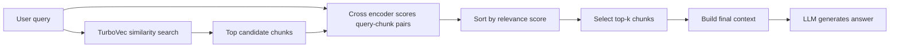

# RAG Reranking bằng Cross Encoder

## Ý tưởng chính

Reranking là bước sắp xếp lại các kết quả đã được truy xuất từ vector database để đưa những đoạn văn phù hợp nhất lên đầu danh sách. Trong RAG, bước truy xuất ban đầu thường dùng embedding để lấy ra một tập ứng viên khá rộng. Sau đó, cross encoder sẽ đọc từng cặp gồm câu hỏi và đoạn văn để chấm điểm mức độ liên quan chính xác hơn.

Trong `cross_encoder.py`, pipeline được triển khai theo hướng sau:

1. Chia văn bản của sách _The Last Lecture_ thành các chunk nhỏ.
2. Tạo embedding cho các chunk và lưu vào TurboVec.
3. Nhận câu hỏi từ người dùng.
4. Dùng TurboVec để lấy ra top 20 chunk gần nhất theo similarity.
5. Ghép câu hỏi với từng chunk và đưa vào cross encoder.
6. Sắp xếp lại các chunk theo điểm liên quan và lấy top 5 kết quả tốt nhất.
7. Dùng các chunk đã rerank để tạo câu trả lời cuối cùng.

## Cross encoder là gì

Cross encoder là mô hình nhận đồng thời cả query và document trong cùng một đầu vào. Khác với embedding model chỉ mã hóa riêng từng văn bản, cross encoder có thể so sánh trực tiếp tương tác giữa câu hỏi và đoạn văn ở mức chi tiết hơn.

Điều này giúp mô hình đánh giá tốt hơn những trường hợp mà similarity search ban đầu chưa phân biệt rõ. Ví dụ, hai chunk có embedding khá gần với query, nhưng chỉ một chunk thực sự trả lời đúng ý người dùng. Cross encoder sẽ chấm điểm lại để chọn chunk chính xác hơn.

## Vì sao reranking hữu ích

Similarity search bằng embedding thường rất nhanh, nhưng nó chỉ tối ưu cho việc lấy ứng viên gần đúng. Kết quả top đầu chưa chắc đã là kết quả tốt nhất về mặt ngữ nghĩa đầy đủ.

Reranking giải quyết vấn đề này bằng cách:

- Giữ tốc độ truy xuất ban đầu nhờ vector search.
- Tăng độ chính xác ở bước chọn kết quả cuối.
- Giảm khả năng đưa các chunk nhiễu vào context cho LLM.

Ngoài ra, reranking không phải là kỹ thuật đứng một mình. Nó có thể kết hợp với query expansion, multi-query retrieval, hybrid search hoặc các bộ lọc khác để tăng khả năng lấy đúng chunk ngay từ đầu, rồi dùng encoder để chọn lại những đoạn thật sự phù hợp nhất.

Nói cách khác, vector search lo phần mở rộng phạm vi, còn encoder lo phần chọn lọc chính xác.

## Demo trong `cross_encoder.py`

### 1. Tạo embedding và lưu vào TurboVec

Đoạn code dưới đây tạo một wrapper đơn giản quanh `SentenceTransformer` để TurboVec có thể dùng nó như một embedding backend:

```python
class SentenceTransformerEmbeddings:
	def __init__(self, model_name: str) -> None:
		self.model = SentenceTransformer(model_name)

	def embed_documents(self, texts):
		return self.model.encode(texts, convert_to_numpy=True, show_progress_bar=False).tolist()

	def embed_query(self, text):
		return self.model.encode([text], convert_to_numpy=True, show_progress_bar=False)[0].tolist()
```

Sau đó, các chunk được nạp vào vector store:

```python
turbo_vec_index = TurboQuantVectorStore(embedding=embedding_model)
turbo_vec_index.add_texts(token)
```

### 2. Truy xuất ứng viên ban đầu

Người dùng nhập câu hỏi và hệ thống lấy ra một tập ứng viên lớn hơn cần thiết để đảm bảo không bỏ sót thông tin quan trọng:

```python
query = input("Enter your question: ")
retrieved_chunks = [doc.page_content for doc in turbo_vec_index.similarity_search(query, k=20)]
```

Ở bước này, TurboVec chỉ đóng vai trò retrieval ban đầu. Đây chưa phải là thứ tự cuối cùng.

### 3. Chấm điểm lại bằng cross encoder

Mỗi chunk được ghép với câu hỏi thành một cặp `[query, chunk]`:

```python
pair_query_chunk = [[query, chunk] for chunk in retrieved_chunks]
scores = cross_encoder.predict(pair_query_chunk)
```

Mô hình `cross-encoder/ms-marco-MiniLM-L-6-v2` trả về một score cho từng cặp. Score càng cao thì chunk càng liên quan với query.

### 4. Chọn top kết quả tốt nhất

Các score được sắp xếp giảm dần để chọn ra những chunk mạnh nhất:

```python
top_indices = np.argsort(scores)[::-1][:5]
top_chunks = [retrieved_chunks[i] for i in top_indices]
context = "\n\n".join(top_chunks)
```

Như vậy, thay vì đưa toàn bộ top 20 chunk vào LLM, hệ thống chỉ giữ lại top 5 chunk có điểm rerank cao nhất.

### 5. Sinh câu trả lời cuối cùng

Những chunk đã rerank được đưa vào prompt để tạo câu trả lời ngắn gọn và bám sát ngữ cảnh:

```python
final_answer = generate_answer(query, context)
print("Final Answer:", final_answer)
```

## Cách hoạt động của pipeline



## Điểm mạnh và hạn chế

Điểm mạnh:

- Reranking giúp chọn đúng chunk hơn so với chỉ dùng similarity search.
- Giữ được tốc độ của retrieval ban đầu nhưng tăng độ chính xác ở bước cuối.
- Hữu ích khi tài liệu có nhiều chunk gần nghĩa nhau nhưng chỉ một số chunk thật sự trả lời đúng câu hỏi.

Hạn chế:

- Chậm hơn vì phải chấm điểm từng cặp query-chunk.
- Tốn thêm tài nguyên tính toán so với chỉ dùng vector search.
- Phụ thuộc vào chất lượng của cả embedding model lẫn cross encoder.

## Kết luận

Reranking bằng cross encoder là một bước rất quan trọng trong RAG khi muốn nâng chất lượng truy xuất mà không đánh đổi toàn bộ tốc độ. Trong demo này, `cross_encoder.py` dùng TurboVec để lấy ra tập ứng viên ban đầu, sau đó dùng cross encoder để chấm điểm lại từng cặp query-chunk và chọn ra các đoạn văn phù hợp nhất trước khi đưa vào LLM. Cách làm này giúp context sạch hơn, đúng hơn, và thường cho câu trả lời ổn định hơn so với chỉ dùng similarity search.
