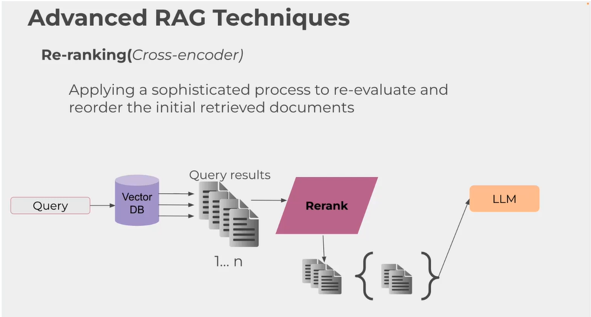
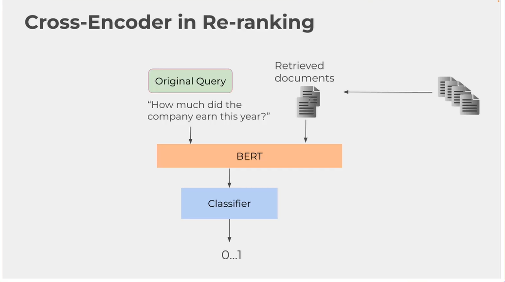
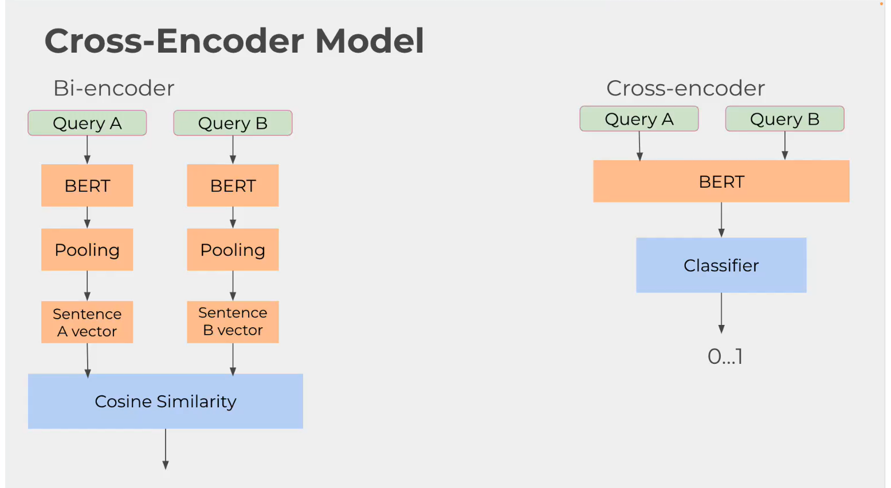
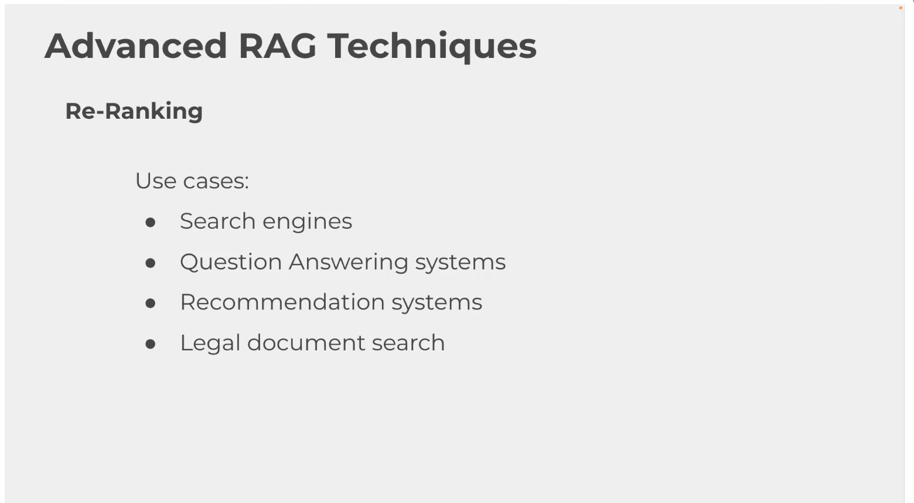

# RAG Reranking bằng Cross Encoder

Reranking là kỹ thuật sắp xếp lại các kết quả đã được truy xuất ban đầu để đưa những chunk phù hợp nhất lên đầu danh sách. Mục tiêu của bước này là làm sạch context trước khi đưa vào LLM, đặc biệt khi retriever ban đầu trả về nhiều đoạn văn gần nghĩa nhưng chưa chắc đúng nhất.

## Ý tưởng chính

Trong RAG, retriever thường dùng embedding để lấy ra một tập ứng viên rộng. Cách này nhanh, nhưng top kết quả đầu tiên chưa chắc là chunk trả lời đúng nhất. Reranking giải quyết bằng cách:

1. Giữ nguyên câu hỏi gốc của người dùng.
2. Dùng retriever ban đầu để lấy một tập chunk ứng viên.
3. Ghép từng chunk với câu hỏi thành một cặp query-document.
4. Dùng cross encoder chấm điểm mức độ liên quan của từng cặp.
5. Sắp xếp lại các chunk theo điểm số và chỉ giữ top-k chunk tốt nhất.
6. Đưa context đã được lọc lại vào bước sinh câu trả lời cuối cùng.

## Cách hoạt động trong code

Trong file `cross_encoder.py`, luồng xử lý đi theo các bước sau:

1. Đọc tài liệu PDF của sách _The Last Lecture_ và chia nhỏ nội dung thành các chunk.
2. Tạo embedding cho các chunk bằng `SentenceTransformerEmbeddings`.
3. Nạp các chunk vào `TurboQuantVectorStore`.
4. Nhận câu hỏi từ người dùng.
5. Dùng similarity search để lấy ra top 20 chunk ứng viên ban đầu.
6. Ghép câu hỏi với từng chunk và đưa vào `CrossEncoder` để chấm điểm.
7. Sắp xếp lại các chunk theo score và lấy top 5 chunk tốt nhất.
8. Ghép các chunk này thành `context` rồi gọi hàm sinh câu trả lời cuối cùng.

Điểm quan trọng là reranking không thay thế retrieval ban đầu. Nó chỉ đóng vai trò bộ lọc thứ hai để chọn lại những chunk thực sự đáng tin hơn trước khi LLM đọc context.

## Cross encoder là gì

Cross encoder là mô hình nhận đồng thời cả query và chunk trong cùng một đầu vào. Khác với embedding model chỉ mã hóa riêng từng văn bản rồi so sánh bằng khoảng cách vector, cross encoder có thể nhìn trực tiếp vào tương tác giữa câu hỏi và đoạn văn để chấm điểm chính xác hơn.

Nhờ vậy, nếu hai chunk đều có vẻ gần với câu hỏi ở mức embedding, cross encoder vẫn có thể phân biệt chunk nào thật sự trả lời đúng ý người dùng.

## Vì sao reranking hiệu quả

Similarity search bằng embedding rất tốt ở khâu lấy ứng viên nhanh, nhưng nó ưu tiên tốc độ hơn độ chính xác chi tiết. Reranking bổ sung một lớp kiểm tra cuối để giảm nhiễu trong context.

Điều này giúp:

- Giữ được tốc độ của retrieval ban đầu.
- Tăng độ chính xác của các chunk được đưa vào LLM.
- Giảm nguy cơ context chứa những đoạn văn gần nghĩa nhưng không liên quan trực tiếp.

Reranking cũng có thể kết hợp với query expansion, hybrid search hoặc multi-query retrieval để tăng chất lượng truy xuất tổng thể. Nói cách khác, retriever lo phần mở rộng phạm vi, còn cross encoder lo phần chọn lọc chính xác.

## Lợi ích

- Tăng chất lượng context trước khi sinh câu trả lời.
- Hữu ích khi có nhiều chunk gần nghĩa nhau nhưng chỉ một số chunk thật sự đúng.
- Giúp LLM ít bị nhiễu hơn vì không phải đọc quá nhiều đoạn văn không liên quan.

## Hạn chế

- Chậm hơn vì phải chấm điểm từng cặp query-chunk.
- Tốn thêm tài nguyên tính toán so với chỉ dùng vector search.
- Phụ thuộc vào chất lượng của cả embedding model lẫn cross encoder.

## Ghi chú về cách đặt tên trong code

Trong `cross_encoder.py`, biến `retrieved_chunks` là danh sách ứng viên ban đầu, còn `top_chunks` là kết quả sau reranking. Tên `context` được dùng cho phần đã lọc xong và đưa vào prompt sinh câu trả lời.

## Tóm tắt

Reranking trong RAG là bước lấy một tập chunk đã truy xuất ban đầu, chấm điểm lại bằng cross encoder, rồi chọn ra những đoạn phù hợp nhất trước khi đưa vào LLM. Kỹ thuật này đặc biệt hữu ích khi tập ứng viên ban đầu còn nhiễu, hoặc khi cần context sạch và chính xác hơn để tăng chất lượng câu trả lời.

